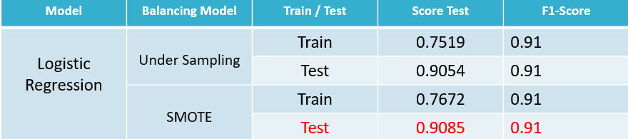

# Virtual-Internship-Experience-IDX

**Tool** : Jupyter Notebook

**Libraries** : Pandas, Numpy, Matplotlib, Seaborn, Sklearn

## Background Problem

Manajemen risiko kredit adalah praktik untuk memitigasi kerugian tersebut dengan memahami kecukupan modal bank dan cadangan kerugian pinjaman pada waktu tertentu. suatu proses yang telah lama menjadi tantangan bagi lembaga keuangan.
Sedangkan resiko kredit (credit risk) adalah suatu resiko kerugian yang disebabkan oleh ketidakmampuan atau gagal bayar dari debitur atas kewajiban pembayaran utangnya, baik utang pokok maupun bunga, ataupun keduanya.
Dengan adanya Machine Learning , kita dapat membantu perusahaan dalam menangani masalah yang terjadi akibat terjadinya Credit Risk.

## Introduction Dataset

1. Dataset ini berisikan data pinjaman dari tahun 2007 sampai 2014.
2. Dataset ini berisikan sebanyak 466.285 baris data dan 75 kolom.

## Data Analysis

 

**Note** : Good Status menandakan peminjam membayar tepat waktu, targetnya adalah mereduce angka dari Bad status.

**Note** : Tujuan dari peminjaman  di dominasi oleh debit consolidation dan credit card

**Note** : Grade B , adalah grade yang paling banyak diberi pinjaman oleh LC kepada para peminjam.

**Note** : Grade A & B , adalah grade yang paling buruk diantara grade lain karna status pembayarannya masih di bawah 10%

**Note**: Status Verified memiliki persentase 36 % dengan total 168055 yang telah di verifikasi oleh LC 

**Note** : Isu dari masalah peminjaman mengalami peningkatan tiap tahunnya berdasarkan dari grafik diatas.

**Note** : Tahun 2014 merupakan tahun dimana terjadinya issue gagal / telat bayar tertinggi dari tahun sebelumnya yang relatif naik turun persentasenya

## Modeling

Untuk melakukan prediksi terhadap pelanggan credit risk di dapatkan hasil tertinggi akurasi dari model logistic regression yaitu 91% dengan metode SMOTE untuk menghandle kasus data target imbalance 

**Note** : Dari proses PreProcessing, Feature Engineering hingga Modeling, didapatkan model terbaik dimana dengan score 0,9085 / 0,91 jika di bulatkan dari model Logistic Regression dengan metode Balancing SMOTE.

## Summary 

Hasil model ini dapat digunakan untuk membantu seorang yang bekerja untuk menangani credit risk dalam menentukan kebijakan dalam menentukan seorang layak di pinjamkan atau tidaknya agar isu gagal bayar yang terjadi pada perusahaan dapat diatasi.

